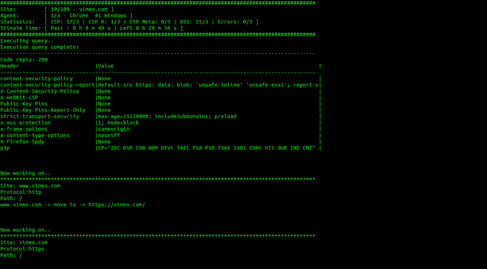

# Security Headers crawler #

A python script to get an overview of the security headers implemented in the web, analyze them and save in a local DB for statistics.

Periodically running this tool, you can see the trend of usage of security headers on a set of website (such as the Top 1 Million websites).

Note: The main focus of this tool is to study the CSP (Content Security Policy) header usage.

### Screenshot ###

Output sample



### How it works ###

For each website given in input:

+ it makes an http / https request
+ it handles the redirection status code (es 301, 302..)
+ it can use just one or different user agents (to check differences)
+ it looks for all types of CSP headers (also in the HTML meta tags)
+ it saves the found headers in a local DB (for further analysis)
+ it saves the HTML code in a compressed format in the local DB
+ it uses different threads to distribute tasks to different workers
+ it temporarily saves cookies and it uses them to correctly handle subsequent HTTP requests (basic functionalities are currently implemented)


### Studied headers ###

+ "content-security-policy"
+ "content-security-policy-report-only"
+ "X-Content-Security-Policy"
+ "X-WebKit-CSP"
+ "Public-Key-Pins"
+ "Public-Key-Pins-Report-Only"
+ "strict-transport-security"
+ "x-xss-protection"
+ "x-frame-options"
+ "x-content-type-options"
+ "X-Firefox-Spdy"
+ "p3p"


### Required libraries: ###

+ python 2.7
+ python imports: httplib, urlparse, csv, sys, sqlite3, datetime, time, os, fromstring, multiprocessing, traceback, zlib

### How to run it ###
 
1) Download the code
```
git clone https://github.com/mkcn/security-headers-crawler.git
```
  2.a) Execute the script (default mode)
```
python main.py
```
  2.b) Execute the script with multi agents (-m) and with an input file (-i FILE) 
```
python main.py -m -i file.cvs
```
 3) The result is stored in output/result.db

### Background mode ###
 
1) Start in background
```
nohup python main.py -r > progress &
```
2) Read progress
```
tail -n 60 progress
```
